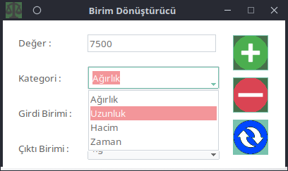

# Birim Dönüştürücü
SI Birim Sisteminde **Ağırlık, Uzunluk, Hacim, Zaman** kategorilerinde birimler arası dönüşüm yapan python uygulaması.

## Eklenecek Özellikler;
* Dönüşüm yapıldığında çıktı değeri panoya kopyalanacak

# Kodun Orjinal Adresi;
[sametgzlgn/birim-donusturme](https://github.com/sametgzlgn/birim-donusturme)
